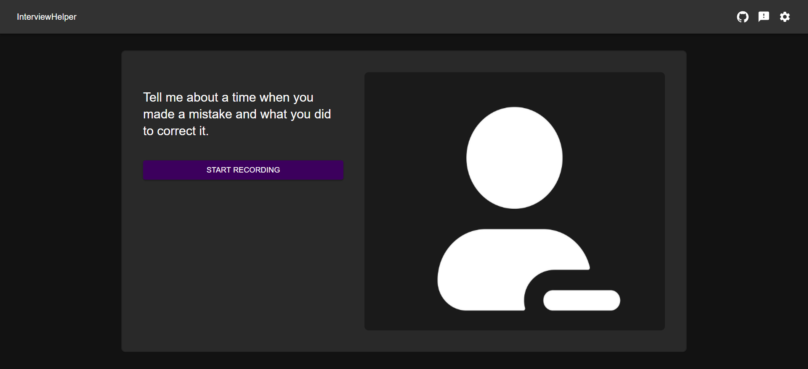
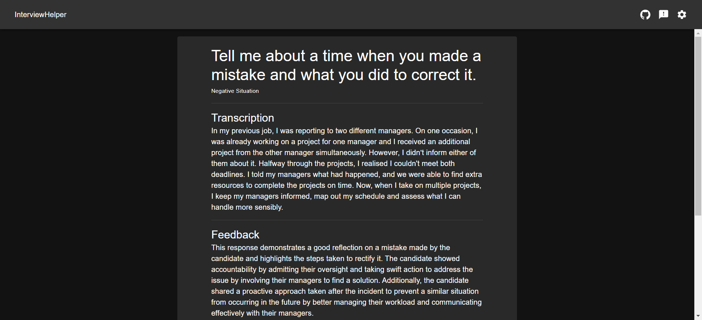
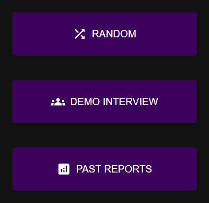

# InterviewHelper
I suck at answering behavioural questions in interviews or online assessments. So I created this to help me practice.

Generates a random question and records camera and microphone feed. (I would be there but I don't feel like showing my face). This was done using HTML5's MediaRecorder API. The questions were sourced from the web.

The recorded audio is then converted to an mp3 file to transfer to the backend Flask app. The backend first transcribes the audio file to text using Whisper. This text is then sent to OpenAI's GPT API with a prompt to generate personalised feedback for improvement.

The homepage offers two modes: Random and Interview. In Random, a single random question is generated, while Interview presents a structured set of questions in a specific order and type. Select Past Reports to review your previous attempts.

There is also a feedback popup in the top right. Feel free to give me any suggestions on how I can improve my project!

# Usage
1. Run `docker-compose up --build`
2. Open `localhost:3000` on your browser
3. [Visit OpenAI](https://platform.openai.com/api-keys) to get an API key
4. Paste key into settings

# Future
- Create my own speech to text ML model
- Fine tune LLM for the purpose of giving personalised feedback for improvement